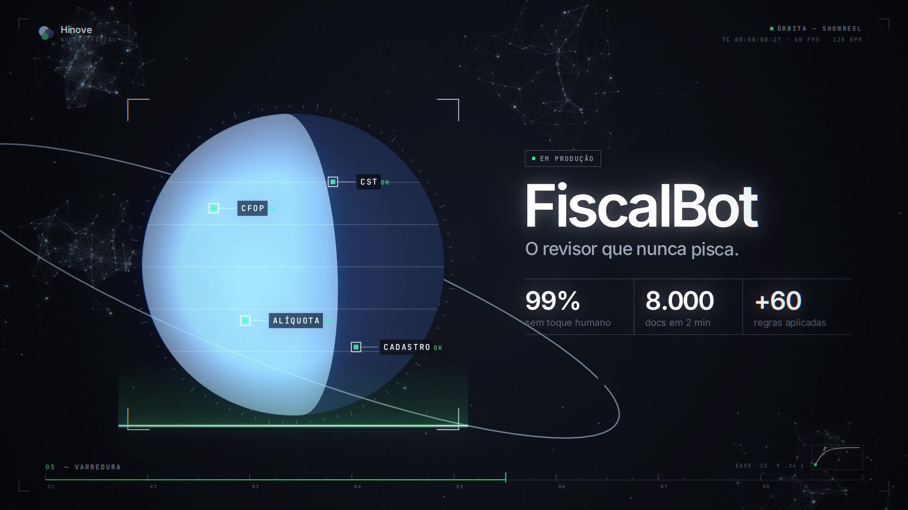

# órbita · showreel

Quinze segundos, 1080p60, 128 BPM: a vitrine **órbita** contada como um reel de motion design.
Oito compassos, um por cena, e cada corte cai numa batida.

[](orbita-showreel.mp4)

▶ **[orbita-showreel.mp4](orbita-showreel.mp4)** · ou abra o [`reel.html`](reel.html) para assistir ao vivo
(parado, mostra a assinatura como pôster; espaço pausa, ← → anda quadro a quadro, F tela cheia)

## Roteiro

| Compasso | Início | Cena | O que acontece |
|---|---|---|---|
| 01 | 0,00 s | Ignição | Um fio de 1px nasce, ganha marcas de régua e se curva num mostrador. A marca Hinove estoura em três notas e voa para o canto, montando o HUD |
| 02 | 1,88 s | Manifesto | *Menos desculpability, mais accountability.* em tipografia cinética: "desculpability" é riscada, e o texto vira ~5 mil partículas que giram no mesmo sentido, *todos remando na mesma direção* |
| 03 | 3,75 s | Sistema | No drop, as partículas se encaixam nas seis órbitas. A câmera inclina do topo para o plano oblíquo do site e os corpos estouram em colcheias |
| 04 | 5,63 s | Alinhamento | Time-lapse orbital com freio: os seis corpos travam alinhados, os vizinhos saem de cena e a câmera mergulha em warp até o FiscalBot |
| 05 | 7,50 s | Varredura | Leitura do FiscalBot: mira, varredura, CFOP / CST / ALÍQUOTA / CADASTRO e KPIs em odômetro. Fecha com um desligamento de CRT no fio de varredura |
| 06 | 9,38 s | Impulso | O fio vira a barra de 20h, que encolhe para 2h30; o −87,5% aterrissa na batida. A barra do tempo do analista liga os seis sistemas em fusas |
| 07 | 11,25 s | Horizonte | A barra se curva e vira o limbo de um planeta. Nasce a luz: *Automatizar não é cortar gente. É devolver o tempo para pensar.* |
| 08 | 13,13 s | Assinatura | A marca volta do HUD, a palavra-marca sobe e uma órbita fecha em volta. Os três círculos pulsam com as três notas da abertura, agora em maior |

Os números vêm do `index.html` e continuam ilustrativos.

## Como é feito

- **`reel.html` + `js/`**: o reel inteiro é uma função pura do tempo desenhada em canvas 2D, sem CSS animation e sem estado entre quadros. Qualquer quadro sai igual em qualquer ordem, em qualquer processo.
- **Mesma linguagem do site**: cores, fios de 1px, cantos de mira e as curvas `--ease` e `--ease-io` do `index.html`. O HUD mostra a curva da casa num editor de curva em miniatura, com o ponto andando no tempo da música. Tipos: Inter e JetBrains Mono (OFL, em `fonts/`).
- **Câmera 3D de verdade**: perspectiva, órbitas projetadas, fase de cada planeta calculada pela posição do sol e a teia de galáxias do site como campo de estrelas, que vira riscos no mergulho.
- **`render.mjs`**: Chromium headless em 4 processos paralelos, com motion blur por subamostragem temporal (8 amostras, 16 nos trechos rápidos, obturador de 180°), bloom com limiar, aberração cromática nos impactos, vinheta e grão. O RGBA cru vai direto para o ffmpeg (H.264, BT.709).
- **`audio/`**: trilha sintetizada do zero com numpy e scipy (bumbo, baixo com sidechain, pads, pluck FM, sinos, whooshes, risers, tape stop no CRT). Cada evento sonoro está preso a um evento visual, com as mesmas curvas; mix em −14 LUFS e −1 dBTP.

## Renderizando

```bash
cd showreel
python3 audio/soundtrack.py soundtrack.wav             # trilha (numpy + scipy)
node render.mjs video --audio soundtrack.wav            # 1080p60 → orbita-showreel.mp4
node render.mjs stills --times 3.75,7.5,13.2            # quadros soltos para revisão
node render.mjs video --scale 0.5 --samples 2           # prévia rápida
```

Requer Node com Playwright (Chromium) e um ffmpeg com libx264 (ou `FFMPEG=/caminho/do/ffmpeg`).
